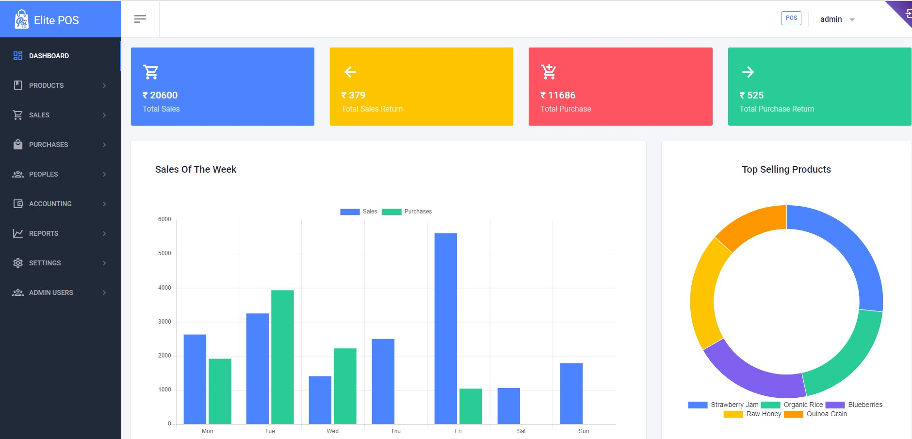
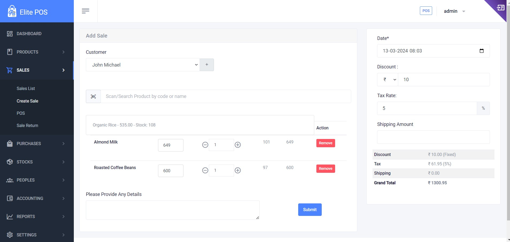

# ElitePOS: POS with Inventory Management System

**ElitePOS** is a comprehensive Point of Sale (POS) system integrated with an advanced inventory management feature, designed specifically for small to medium-sized businesses looking to streamline their sales processes and inventory management. Built using the latest web technologies, it offers an intuitive user interface, real-time data analytics, and seamless integration capabilities, making it a powerful tool for businesses aiming to enhance operational efficiency and customer satisfaction.

## Documentation
Read the [Documentation](https://dreamstudio-satheesh.github.io/Docs-ElitePOS/) for more configuration options.

## Dashboard

## Create Sale

## Key Features

- Intuitive Sales Interface: Easy-to-use sales dashboard allowing for quick customer transactions, product lookups, and payment processing. Supports multiple payment methods including cash, credit/debit cards, and digital wallets.
- Real-Time Inventory Management: Automatically updates inventory levels as sales occur, providing accurate stock counts, low stock alerts, and automated reorder notifications.
- Advanced Reporting: Generates detailed sales reports, inventory analytics, and customer purchase histories to aid in strategic decision-making.
- Customer Management: Stores and manages customer information for personalized marketing, loyalty programs, and sales analysis.
- Multi-Store Support: Seamlessly manages operations across multiple locations, allowing for centralized control of products, prices, and inventory.
- User Access Control: Configurable roles and permissions to ensure employees have appropriate access to the system functions relevant to their job responsibilities.
- Cloud-Based Solution: Offers secure, cloud-based access to the POS system from anywhere, ensuring data is backed up and always accessible.
- Integration Capabilities: Easily integrates with existing ERP, CRM, and accounting software to synchronize business operations.

**ElitePOS** is not just a transactional tool but a complete business management solution that enhances operational efficiency, provides valuable insights, and helps deliver a superior customer experience.

## Getting Started

To get started with ElitePOS:

1. Clone the repository to your local machine or server.
2. Execute `composer install` to install the necessary Laravel dependencies.
3. Configure your `.env` file with your database and application settings.
4. Go to your website address to start the installation wizard.

For detailed installation and setup instructions, please refer to the [Documentation](https://dreamstudio-satheesh.github.io/Docs-ElitePOS/) file.

## Technologies Used

- **Frontend**: Utilizes html css and javascript for a responsive user interface.
- **Backend**: Built on Laravel and livewire , providing a robust and scalable server-side solution.
- **Database**: Employs MongoDB/MySQL for efficient data storage.
- **Security**: Implements OAuth 2.0 for secure authentication and authorization.

## Credits and Licensing

### Laravel Framework

ElitePOS is built on the Laravel framework, which is an open-source project licensed under the [MIT license](LICENSE-Laravel). Laravel is a trademark of Taylor Otwell. For more information on Laravel, visit [laravel.com](https://laravel.com).

### Themefisher Theme

Some user interface elements of ElitePOS utilize themes by Themefisher, available under the [MIT license](LICENSE-Themefisher). Our sincere appreciation goes to Themefisher for their high-quality design work.

## Support

For support inquiries, bug reporting, or feature requests, [click here](https://github.com/dreamstudio-satheesh/ElitePOS/issues/new).    contact us at elitepos@dreamcoderz.com.

## Authors

## Acknowledgments

- Laravel Community
- Themefisher Team
- Our esteemed partners and vendors who make this possible

